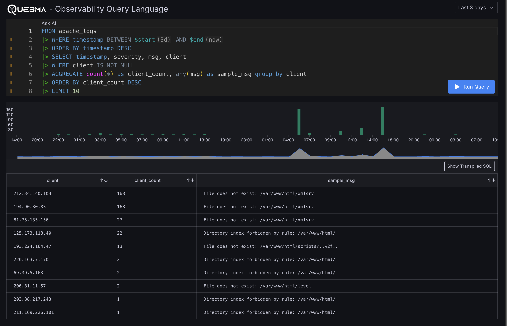

# Observability Query Language

This repository is a demo of the new Observability Query Language. This is a research project 
and is not production ready. 

The demo consists of:
- a language parser (PipeSQL implementation) 
- sample datasets (tables in a ClickHouse database)  
- a data explorer application (Grafana plugin) 




## Get Started

You'll need only two tools to run the demo:  
* git  
* Docker  

Here are the steps:

1. Clone the repository:
    ```bash
    git clone https://github.com/QuesmaOrg/oql.git
    ```

2. Copy `.env.example` to `.env` (by default it will use ClickHouse running in Docker):
    ```bash
    cp .env.example .env
    ```

3. Build and run. The first build may take a few minutes:
    ```bash
    docker compose up --build
    ```

4. Click here to start exploring:  
    [http://localhost:3000/a/quesma-oql-app](http://localhost:3000/a/quesma-oql-app)

## Examples 

```
-- OpenSSH logs
FROM openssh_logs
|> ORDER BY timestamp DESC
|> WHERE timestamp BETWEEN $start AND $end

-- Filter out sshd logs, break-in attempts logs
|> WHERE source = 'sshd'
|> WHERE msg ILIKE '%break-in attempt!%'

-- Parse IP, hostname from loglines
--|> EXTEND ENRICH_LLM(msg, 'extract IP address from logline') AS extracted_ip
|> WHERE msg ILIKE 'reverse mapping checking getaddrinfo for % [%] failed - POSSIBLE BREAK-IN ATTEMPT!'
|> EXTEND PARSE_PATTERN(msg, 'reverse mapping checking getaddrinfo for % [%] failed - POSSIBLE BREAK-IN ATTEMPT!') AS extracted_host, extracted_ip

|> SELECT timestamp, msg, extracted_ip

-- IP enrichment
|> EXTEND ENRICH_IP(extracted_ip) AS enriched_ip

-- IP enrichment - bot IPs
|> EXTEND ENRICH_IP_BOTS(enriched_ip.hostname) AS is_bot
|> WHERE is_bot

-- Aggregate by country
|> AGGREGATE count(*) AS country_count GROUP BY enriched_ip.country_long
|> ORDER BY country_count DESC

|> LIMIT 100
```
Showcased Quesma-PipeSQL operators: PARSE_PATTERN, ENRICH_IP, ENRICH_IP_BOTS

## Datasets

You can explore the following tables. Tables contain logs from different sources.

- `apache_logs` Logs from https://zenodo.org/records/8275861 (Apache.zip/Apache_full.log)
- `hadoop_logs`  Logs from https://zenodo.org/records/8275861 (Hadoop.zip/Hadoop_full.log)
- `linux_logs`  Logs from https://zenodo.org/records/8275861 (Linux.zip/Linux_full.log)
- `openssh_logs`  Logs from https://zenodo.org/records/8275861 (OpenSSH.zip/OpenSSH_full.log)


Observability Query Language uses the IP2Location LITE database for [IP geolocation](https://lite.ip2location.com).


## Learn more

* [SQL Has Problems. We Can Fix Them: Pipe Syntax In SQL](https://research.google/pubs/sql-has-problems-we-can-fix-them-pipe-syntax-in-sql/)


